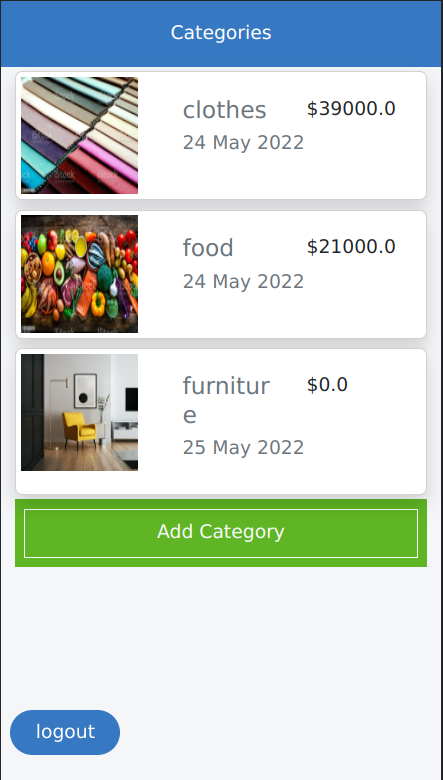
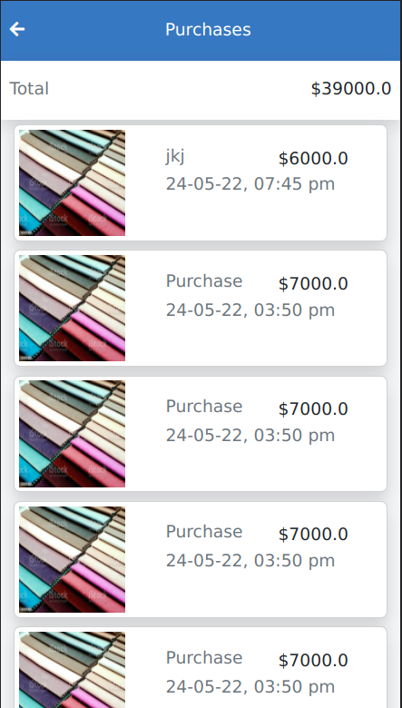

## Description

The budgeter is created with ruby on rails and allows logged in users to create view how their money is spent on various categories of expenses.

## Screenshots



## Demo video

[](https://www.loom.com/share/1c8ee463a6da4f55ba6fa450618e3e2a)

## Video link
```
https://www.loom.com/share/1c8ee463a6da4f55ba6fa450618e3e2a
```
## Built With

- Ruby
- Ruby on Rails

## Getting Started

To get the content of this project locally you need to run this command in your terminal:
``` bash
git clone your https://github.com/matovu-farid/budgeter.git
cd budgeter
bundle install
rails s
```
## Tests
To run the tests, navigate to the root directory of this app and run
```ruby
rspec spec
```
## Deployment
The app is deployed at this url
[link](https://floating-meadow-12775.herokuapp.com/)
```
https://floating-meadow-12775.herokuapp.com/
```

## Authors

👤 **Matovu Farid Nkoba**

- GitHub: [@matovu-farid](https://github.com/matovu-farid)
- Twitter: [@matovu100](https://twitter.com/matovu100)
- LinkedIn: [matovu-farid](https://www.linkedin.com/in/matovu-farid-48b80257)


## Show your support

Give a ⭐️ if you like this project!

## Acknowledgments
- Original design idea by [Gregoire Vella on Behance](https://www.behance.net/gregoirevella).
- Hat tip to Microverse


## 📝 License

This project is [MIT](./MIT.md) licensed.
